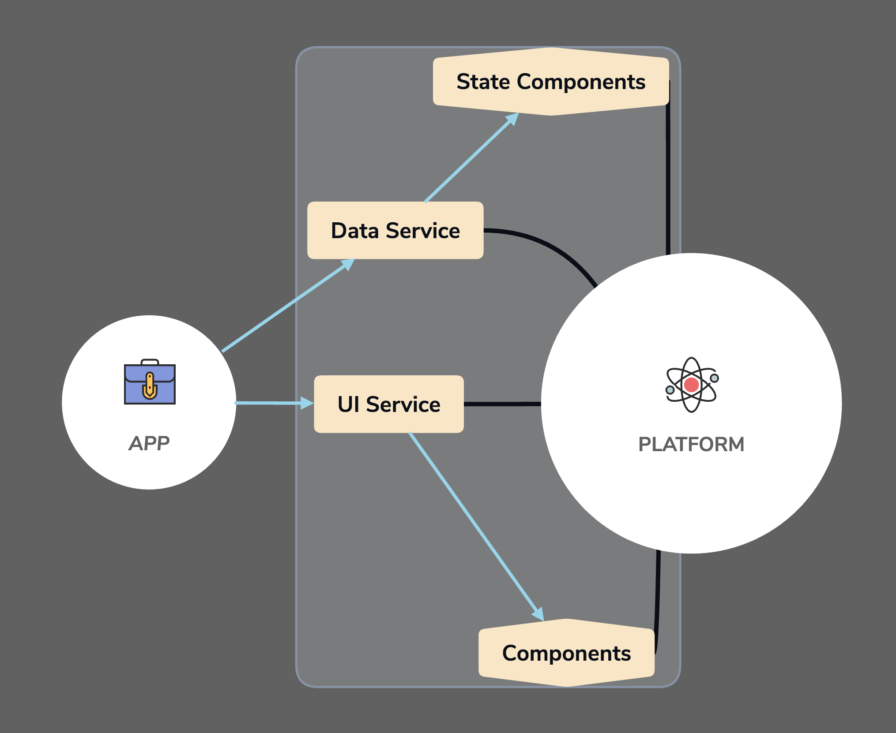

# Platform Architecture

<i>v. Alpha 0.0.1</i>

## Intro

Platform based architecture is a solution to boilerplate in our projects.

As a very keen student of Theory of Evolution I just applied its way of doing things to this architecture.

Evolution didn't keep its best gene pool in a separate vessel as we do in form of boilerplate. Everything was in play all the time or it was just dropped out of race. Species (in our case projects) were introduced along the way with existing improvements that were available and they refined the process for next iteration/species.

No iteration/species was a failure or success just a step towards the next one.

Platform Architecture is the system of Evolution. Every project that you would build based on this architecture would be an iteration that would improve Platform through its lifecycle. But unlike Evolution its gonna have a guiding hand, we don't need to discard old project that were based on previous iterations of the Platform. We can just bring them up to speed with lessons learned along the way (i.e update the version).

## Usage

This architecture is generic enough that it doesn't relay on any tools or Programming Paradigm. To implement this there needs to be a Platform "go figures!". Its essentially the bare minimum setup that is gonna be common among iterations.

It being the platform its gonna keep growing as iterations pass. As every iteration adds features to the platform it can also remove dead features out too if its certain that those parts are absolutely don't serve any purpose anymore.

When a new project/iteration is required that iteration brings along its features that are unique to it (else they be in common setup i.e platform) through common interface and Platform spits out a new iteration. This is creation time, at this moment iteration provides all its feature requirements and gets generated.

The main concept of this setup is that the Platform is the endpoint. It generates outputs. It doesn't gets plugged into anything rather iterations/projects get plugged in to Platform just like a USB stick gets plugged into a PC not the other way around.

## Examples

1. [React Platform](https://github.com/ahmad2smile/react-platform)
2. Xamarin Platform (TODO)

A Xamarin Framework and a React App implementation is underway but its core concept looks something like following,

  

